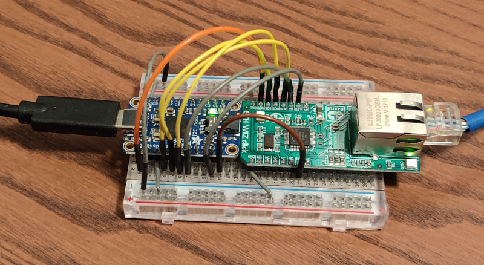

# W5500 Testsuite

These are hardware-in-the-loop tests for the W5500.

## Setup

Like all embedded development this takes a bit of effort to setup.

This uses a FT232H chip to communicate with the W5500 SPI bus over USB.

I used the [Adafruit FT232H] and a [ETH WIZ Click]. Both are available from digikey.

The W5500 uses a lot of power, check that your FT232H board has a 3.3V regulator capable of a few hundred milliamps.

Make the following connections.

| W5500 | FT232H |
|-------|--------|
| SCK   | D0     |
| MOSI  | D1     |
| MISO  | D2     |
| CS    | D3     |
| RST   | D6     |
| INT   | D7     |

Connect the FT232H to USB, and the W5500 to Ethernet.



## Running

```console
$ cargo run -p testsuite
    Finished release [optimized] target(s) in 0.02s
     Running `target/release/testsuite`
[1/3] Running test dhcp_bind
2022-04-22T22:43:55.067958012-07:00 - DEBUG - sending DHCPDISCOVER xid=905B82A8
2022-04-22T22:43:55.080392158-07:00 - INFO - sn_ir=SocketInterrupt(16)
2022-04-22T22:43:56.104616865-07:00 - DEBUG - RX 306 B from 10.0.0.1:67
2022-04-22T22:43:56.106164985-07:00 - DEBUG - sending DHCPREQUEST xid=1A68E4E5
2022-04-22T22:43:56.117174960-07:00 - INFO - sn_ir=SocketInterrupt(16)
2022-04-22T22:43:56.148839088-07:00 - DEBUG - RX 300 B from 10.0.0.1:67
2022-04-22T22:43:56.151319737-07:00 - INFO - subnet_mask: 255.255.255.0
2022-04-22T22:43:56.151644057-07:00 - INFO - gateway: 10.0.0.1
2022-04-22T22:43:56.152851777-07:00 - INFO - renewal_time: 43200
2022-04-22T22:43:56.153477767-07:00 - INFO - rebinding_time: 75600
2022-04-22T22:43:56.153801686-07:00 - INFO - lease_time: 86400
2022-04-22T22:43:56.154138626-07:00 - INFO - DNS: 10.0.0.4
2022-04-22T22:43:56.154458176-07:00 - INFO - dhcp.ip: 10.0.0.155
2022-04-22T22:43:56.156321016-07:00 - INFO - DHCP is bound
[2/3] Running test mqtt_connect
2022-04-22T22:43:56.156329616-07:00 - INFO - Connecting to MQTT server at 10.0.0.4:1883
2022-04-22T22:43:56.159713544-07:00 - DEBUG - Init -> WaitConInt with timeout 1
2022-04-22T22:43:56.363851436-07:00 - INFO - CONN interrupt
2022-04-22T22:43:56.363879986-07:00 - DEBUG - WaitConInt -> Init without timeout
2022-04-22T22:43:56.366081535-07:00 - DEBUG - Init -> WaitConAck with timeout 1
2022-04-22T22:43:56.366719165-07:00 - INFO - SENDOK interrupt
2022-04-22T22:43:56.367642024-07:00 - DEBUG - recv CONNACK len 9
2022-04-22T22:43:56.368568774-07:00 - INFO - Sucessfully connected
2022-04-22T22:43:56.368579984-07:00 - DEBUG - WaitConAck -> Ready without timeout
2022-04-22T22:43:56.369243334-07:00 - INFO - RECV interrupt
[3/3] Running test dns_query
name=Some("docs.rs")
qtype=Ok(A)
class=Ok(IN)
ttl=60
rdata=Some(Ipv4Addr { octets: [18, 65, 229, 76] })
name=Some("docs.rs")
qtype=Ok(A)
class=Ok(IN)
ttl=60
rdata=Some(Ipv4Addr { octets: [18, 65, 229, 105] })
name=Some("docs.rs")
qtype=Ok(A)
class=Ok(IN)
ttl=60
rdata=Some(Ipv4Addr { octets: [18, 65, 229, 80] })
name=Some("docs.rs")
qtype=Ok(A)
class=Ok(IN)
ttl=60
rdata=Some(Ipv4Addr { octets: [18, 65, 229, 115] })
```

[Adafruit FT232H]: https://www.adafruit.com/product/2264
[ETH WIZ Click]: https://www.mikroe.com/eth-wiz-click
